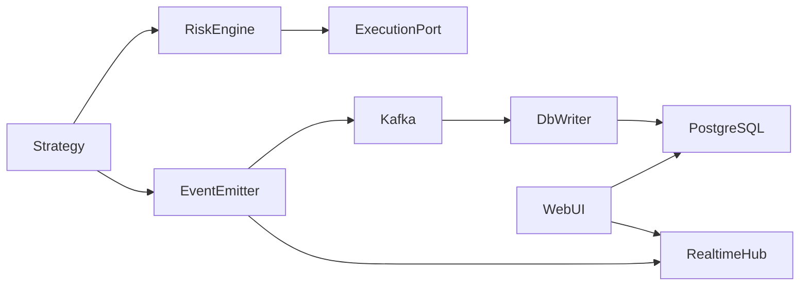

# Architecture

## Overview

Bitunix futures trading platform with a **hot path** (strategy loop) isolated from PostgreSQL writes.

## Services

| Service | Port | Role |
|---------|------|------|
| trading-api | 8000 | Config CRUD, history, backtests, control |
| trading-realtime-ws | 8001 | WebSocket fan-out to UI |
| trading-engine | — | Strategy runner |
| trading-db-writer | — | Kafka consumer |

## Execution modes

All modes use the same `Strategy` subclass and `RiskEngine.propose_order()`.

- **live** — `BitunixLiveExecution` sends real REST orders; ledger used for reconciliation
- **dry_run** — live market data, `SimulatedLedger` fills at market
- **backtest** — `BacktestMarketData` replays klines; same ledger/fee/slippage models

## Risk model

- `min_investment_usd` — fixed stake per order
- `leverage_multiplier` — exposure multiplier (not changing stake)
- Auto bump on margin errors up to `max_leverage_multiplier`

## Adding a strategy

1. Create `strategies/my_strategy/strategy.py` subclassing `Strategy`
2. Register in `strategies/registry.py`
3. Create row via web UI (Beállítások) with `strategy_type=my_strategy`

## Configuration

Only `DATABASE_URL`, `KAFKA_BOOTSTRAP`, `SECRETS_MASTER_KEY` in env. API keys and parameters in PostgreSQL (encrypted credentials).
